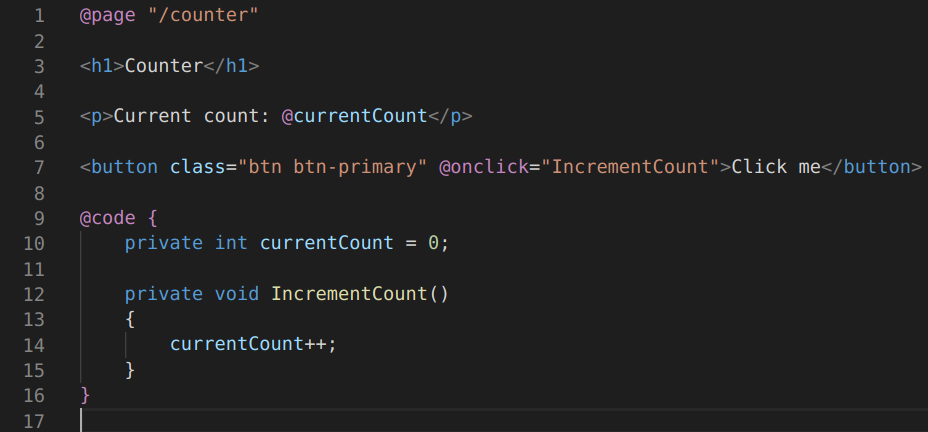
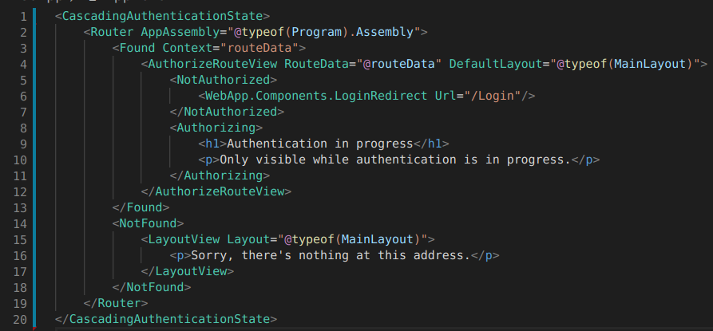

# Blazor - Concepts de base

## Blazor - Fichiers `*.razor` & composants

:::: columns
::: column

{width="50%"} \

{width="100%"} \


:::
::: column

 -  Permet de mixer le code C\# et html à même le fichier `*.razor`.

 -  Le composant est un object C\#, pouvant avoir des états, etc.

 -  Il est possible de complètement séparer le code C\# pour qu'il soit
    dans un `*.cs`. 
    
    On utilise alors une petite convention de noms.

:::
::::


## Blazor - Razor - Code blocs

```razor
@{
    var quote = "The future depends on what you do today. - Mahatma Gandhi";
}

<p>@quote</p>
```

## Blazor - Razor - Looping / iterating

```razor
@foreach (var person in people)
{
    <p>Name: @person.Name</p>
    <p>Age: @person.Age</p>
}
```

## Blazor - Razor - Comments

```razor
@*
    blabla
*@
```

## Blazor - Razor - Events

Producer component side:

```cs
[Parameter]
public EventCallback<MyEventPayload> OnMyEvent { get; set; }

// ..

public async Task SomeOtherMethod()
{
    // ..
    await OnMyEvent.InvokeAsync(MyEventPayload());
}
```

Consumer side;

```razor
<MyComponent
  OnMyEvent="MyEvent"
>
</MyComponent>
```

```cs
public async Task MyEvent(MyEventPayload payload)
{
    // React here.
}
```


## Blazor - `App.razor`

{width="100%"} \

