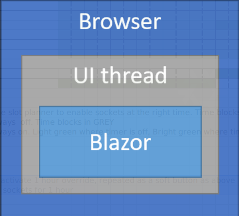

# Blazor - Concepts avancées

## Blazor - Hosting models

:::: columns
::: column

{width="60%"} \

{width="60%"} \

:::
::: column

 -  Blazor WebAssembly

     -  WASM .NET runtime téléchargé coté client via `blazor.webassembly.js`.

 -  Blazor Server

     -  Côté client plus léger `blazor.server.js` établit une connection
        *SignalR* avec le server.
     -  Support de plus vieux navigateurs (sans support *WASM*).
     -  C'est le *hosting model* que nous avons utilsé.

:::
::::


## Blazor Server - Rendering mode

:::: columns
::: column

Définit dans `_Host.cshtml` via l'attribut `render-mode` du `app.component`.

```html
<!-- ... -->
<body>
    <!-- ... -->
    <app>
        <component type="typeof(App)" render-mode="ServerPrerendered" />
    </app>
    <!-- ... -->
</body>
</html>
```

:::
::: column

 -  Voici les mode que j'ai pu essayé:

     -  `ServerPrerendered`

         -  Un rendu du *DOM* est effectué côté server à l'initialization
            de l'app (code roulé côté server).
         -  Ensuite, l'application blazor effectue le rendu côté client.

     -  `Server`

         -  Pas de rendu côté server, rendu *DOM* complètement côté client.

 -  Autres valeures possibles:

    `Static`, `WebAssembly`, `WebAssemblyPrerendered`:

    Voir [`render-mode` - doc] pour plus de détails.

:::
::::


[`render-mode` - doc]: https://docs.microsoft.com/en-us/dotnet/api/microsoft.aspnetcore.mvc.rendering.rendermode?view=aspnetcore-5.0


## Blazor - Validation formulaires


 -  2 tags intéressant à connaître:
 
    ```razor
    <DataAnnotationsValidator />
    <ValidationSummary />
    ```

 -  Une autre découvert côté validation:

    [FluentValidation](https://fluentvalidation.net/)


## Blazor - Authorization

From `*.razor` / blazor pages and components:

It can be retrived using `@context.User` (`context` being of type
`AuthenticationState`) when inside the `AuthorizeView` which itself should be
inside the top level `App.razor` `CascadingAuthenticationState`.

```cs
<AuthorizeView>
    <Authorized>
        @context.User.Identity.Name
    </Authorized>
</AuthorizeView>
```

From a *blazor component*:

Otherwise, from a *blazor component* (still within a top level
`CascadingAuthenticationState`), it can be retrieve using the *cascading
parameter* of type `Task<AuthenticationState>`:

```cs
[CascadingParameter]
private Task<AuthenticationState> AuthenticationStateTask { get; set; }

protected override async Task MyTask()
{
    AuthenticationState state = await AuthenticationStateTask;
}
```
